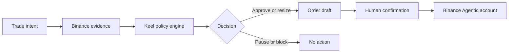

# Keel

**A personal risk governor for Binance Agent OS.**

[Live demo](https://keel-agent-os.ahmardchain.chatgpt.site) · [Binance Agent OS proof](https://chatgpt.com/s/t_6a9c48c8e5d48191b6fd7148ebf844c0) · [Agent skill](agent/keel/SKILL.md) · [Deterministic evaluator](agent/keel/scripts/evaluate-risk.mjs)

Keel sits between a trader's intent and the order button. It reads current Binance market and account evidence, applies the trader's own loss, concentration, cooldown, velocity, and liquidity rules, then returns one deterministic decision:

- `APPROVE` — the trade fits the active rulebook;
- `RESIZE` — a smaller order fits;
- `PAUSE` — wait for a temporary risk condition to clear;
- `BLOCK` — a hard protection rule has fired.

Keel is not a signal bot. It does not predict which coin will rise. It helps a user follow the rules they already chose when emotion is highest.

## Product thesis

Most trading agents optimize entry. Keel governs permission. The language model can understand the trader's intent and collect evidence, but it cannot override the rulebook or silently increase the deterministic policy size.

| A signal bot asks | Keel asks |
| --- | --- |
| “What should I buy?” | “Does this trade fit the rules I adopted?” |
| “Can I enter faster?” | “Is the evidence fresh and the size safe?” |
| “Can the agent execute?” | “What still requires my confirmation?” |

## Demo

> “Buy $1,200 of SOL because it is pumping.”

The included fixture has $4,860.20 equity, $389 of existing SOL exposure, and a 15% maximum per asset. Keel reads live public Binance market data, calculates a $729.03 SOL cap, and resizes the proposed order to $340. The web demo can prepare this safe draft, but it never transmits an order.

### Judge Mode

The interface includes three one-click, deterministic cases that expose the behavioral layer without depending on market timing:

| Case | Trader state | Expected decision |
| --- | --- | --- |
| 01 | Planned BTC entry within the rulebook | `APPROVE` |
| 02 | Oversized SOL request driven by FOMO | `RESIZE` to $340 |
| 03 | Revenge trade after the daily stop | `BLOCK` |

Judge fixtures are explicitly labeled. **Live check** remains separate and uses public Binance market evidence with the demo account.

### User-owned rulebook

Live checks use limits the trader can edit in the interface: maximum exposure per asset, daily loss stop, consecutive-loss cooldown, five-minute velocity, and maximum clean spread. The rulebook is kept only in device-local storage and every change forces a fresh evaluation and receipt. Judge Mode stays locked to the documented defaults so its results remain reproducible.

### Keel Risk Receipt

Every completed check can issue a downloadable `keel-risk-receipt-v1` JSON artifact. It contains the intent, evidence provenance and timestamps, account fixture, complete policy snapshot, deterministic verdict, safe size, execution state, and a canonical SHA-256 digest. Editing any protected field invalidates the fingerprint. The interface can load a downloaded receipt and independently recompute its fingerprint, producing an explicit verified or failed state.

## Architecture



| Layer | Responsibility |
| --- | --- |
| Web demo | Intent parsing, live public ticker/order-book evidence, decision UI |
| Agent skill | Binance read orchestration, evidence freshness, confirmation protocol |
| Risk evaluator | Deterministic sizing and reason codes; no network or credentials |
| Binance Agent OS | Scoped account data and confirmed Spot execution in an Agentic sub-account |

## Run the web demo

Requirements: Node.js 22.13 or newer.

```bash
npm ci
npm run dev
```

Then open the local URL printed by the development server. The demo calls Binance's public Spot REST endpoints server-side. If public data is temporarily unavailable, the interface labels and uses a fixed fallback snapshot; it never disguises fixture data as live.

Verify the production bundle and policy engine:

```bash
npm run build
node --test tests/keel-risk.test.mjs
```

Reproduce the exact three-case Judge Mode from the terminal:

```bash
npm run demo:judge
```

The evaluator's JSON output includes the same tamper-evident receipt envelope:

```bash
node agent/keel/scripts/evaluate-risk.mjs --demo
```

Any downloaded receipt can also be verified without the web interface:

```bash
node agent/keel/scripts/evaluate-risk.mjs --verify-receipt < receipt.json
```

## Use the Agent OS skill

1. Connect the official [Binance MCP Server](https://developers.binance.com/en/docs/agent-native/mcp-server/agentic) through your supported AI client. Start with Market Data and Account scope; add Trade only when you are ready to test confirmed execution.
2. Install the official Binance skill:

   ```bash
   npx skills add https://github.com/binance/binance-skills-hub/tree/main/skills/binance/binance
   ```

3. Add the local [`agent/keel`](agent/keel) skill to the same client, then ask:

   ```text
   Use Keel to check whether buying 1,200 USDT of SOL fits my rulebook.
   ```

You can inspect the evaluator without an account or credentials:

```bash
node agent/keel/scripts/evaluate-risk.mjs --demo
```

## Safety model

- Spot-only MVP; no margin, derivatives, withdrawals, or transfers.
- Read operations happen before any Trade scope is needed.
- Missing or stale evidence fails closed.
- A `RESIZE` decision can only prepare the approved size, never the requested size.
- Every order requires a fresh, exact summary and Binance confirmation.
- Every completed evaluation can be exported with a SHA-256 integrity fingerprint.
- No credentials are requested, logged, or stored by Keel.
- The web experience is a simulation and cannot execute trades.

The official Binance MCP uses a dedicated Agentic sub-account, exposes no withdrawal scope, and requires user confirmation before trades and transfers. Users remain responsible for every trade they approve.

## Project structure

```text
agent/keel/SKILL.md                  Agent workflow and safety boundary
agent/keel/scripts/evaluate-risk.mjs Deterministic policy engine
app/api/market/route.ts              Public Binance market adapter
app/page.tsx                         Interactive decision interface
lib/keel.ts                          Browser policy and receipt engine
tests/keel-risk.test.mjs             Core policy invariants
```

Built for Track A of the Binance Agent OS Mini Hackathon.
