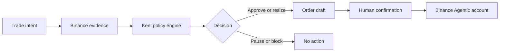

# Keel

**A personal risk governor for Binance Agent OS.**

Keel sits between a trader's intent and the order button. It reads current Binance market and account evidence, applies the trader's own loss, concentration, cooldown, velocity, and liquidity rules, then returns one deterministic decision:

- `APPROVE` — the trade fits the active rulebook;
- `RESIZE` — a smaller order fits;
- `PAUSE` — wait for a temporary risk condition to clear;
- `BLOCK` — a hard protection rule has fired.

Keel is not a signal bot. It does not predict which coin will rise. It helps a user follow the rules they already chose when emotion is highest.

## Demo

> “Buy $1,200 of SOL because it is pumping.”

The included fixture has $4,860.20 equity, $389 of existing SOL exposure, and a 15% maximum per asset. Keel reads live public Binance market data, calculates a $729.03 SOL cap, and resizes the proposed order to $340. The web demo can prepare this safe draft, but it never transmits an order.

## Architecture



| Layer | Responsibility |
| --- | --- |
| Web demo | Intent parsing, live public ticker/order-book evidence, decision UI |
| Agent skill | Binance read orchestration, evidence freshness, confirmation protocol |
| Risk evaluator | Deterministic sizing and reason codes; no network or credentials |
| Binance Agent OS | Scoped account data and confirmed Spot execution in an Agentic sub-account |

## Run the web demo

Requirements: Node.js 22.13 or newer.

```bash
npm ci
npm run dev
```

Then open the local URL printed by the development server. The demo calls Binance's public Spot REST endpoints server-side. If public data is temporarily unavailable, the interface labels and uses a fixed fallback snapshot; it never disguises fixture data as live.

Verify the production bundle and policy engine:

```bash
npm run build
node --test tests/keel-risk.test.mjs
```

## Use the Agent OS skill

1. Connect the official [Binance MCP Server](https://developers.binance.com/en/docs/agent-native/mcp-server/agentic) through your supported AI client. Start with Market Data and Account scope; add Trade only when you are ready to test confirmed execution.
2. Install the official Binance skill:

   ```bash
   npx skills add https://github.com/binance/binance-skills-hub/tree/main/skills/binance/binance
   ```

3. Add the local [`agent/keel`](agent/keel) skill to the same client, then ask:

   ```text
   Use Keel to check whether buying 1,200 USDT of SOL fits my rulebook.
   ```

You can inspect the evaluator without an account or credentials:

```bash
node agent/keel/scripts/evaluate-risk.mjs --demo
```

## Safety model

- Spot-only MVP; no margin, derivatives, withdrawals, or transfers.
- Read operations happen before any Trade scope is needed.
- Missing or stale evidence fails closed.
- A `RESIZE` decision can only prepare the approved size, never the requested size.
- Every order requires a fresh, exact summary and Binance confirmation.
- No credentials are requested, logged, or stored by Keel.
- The web experience is a simulation and cannot execute trades.

The official Binance MCP uses a dedicated Agentic sub-account, exposes no withdrawal scope, and requires user confirmation before trades and transfers. Users remain responsible for every trade they approve.

## Project structure

```text
agent/keel/SKILL.md                  Agent workflow and safety boundary
agent/keel/scripts/evaluate-risk.mjs Deterministic policy engine
app/api/market/route.ts              Public Binance market adapter
app/page.tsx                         Interactive decision interface
tests/keel-risk.test.mjs             Core policy invariants
```

Built for Track A of the Binance Agent OS Mini Hackathon.
